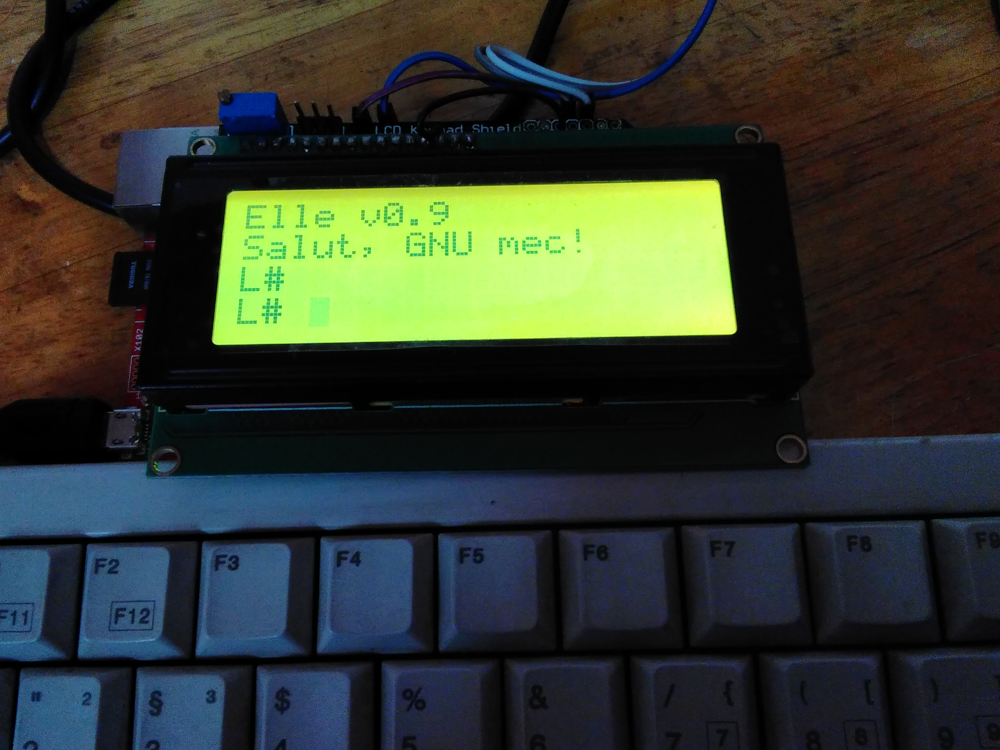
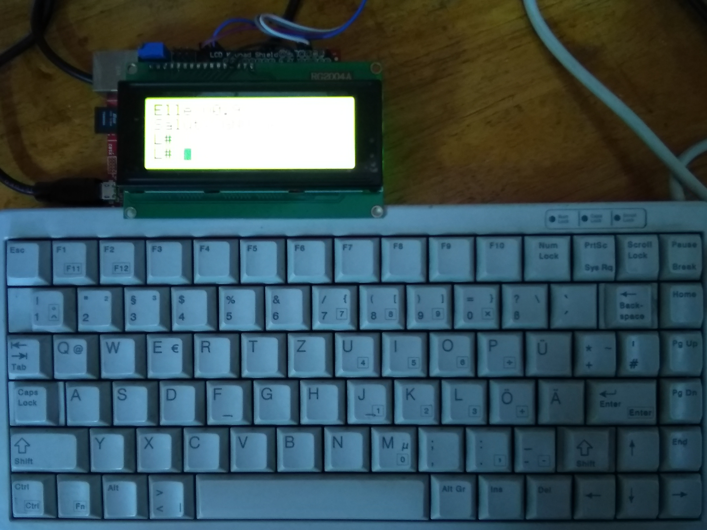
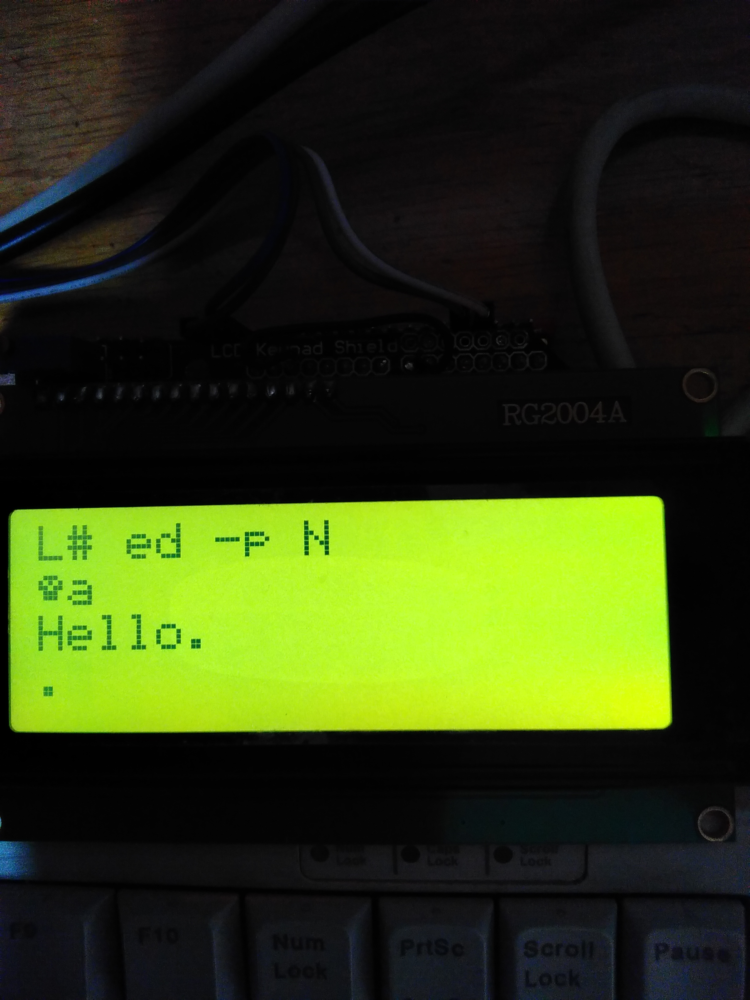

The Elle machine
================

Elle is a tiny, self hosted Lua machine. It is built around the
Infineon XMC4700-F144x2048 (ARM Cortex M4) microcontroller. It uses a
20x4 LCD as its main display and a PS/2 keyboard interface for
standard input. One can simply invoke Lua (and its bytecode compiler)
directly from the Elle (OR simply "L") shell. Elle also provides a
port of the GNU Ed line editor (v1.16) for editing code. All code can
be stored on an SD card. To read a file from the GNU Ed session,
simply say "r /mmc/your_file.extension" (assuming it exists there
already).

Elle is influenced by the eLua project. All motivation and support (to
me, personally) comes from SimpleMachines, Italy. Happy hacking!

In case you were wondering: I coined "GNU mec!" (see pictures) as a
pun in a lab in France for fun - for - all programs are GNU Made.

Acknowledgments 
===============

The Hempl project is named after "Hempel", a good friend from Munich.
He also introduced Raman to Augustiner Edelstoff and Schneider Weisse
;)

Narasimha (Simba) Vedala (sometimes, invoked by R in recursions as
NIL) for all the insanely long technical and philosophical discussions
with cold beers. The GNU Ed skull prompt (see what happens when you
say "ed -p N") is indicative of N's digital presence. Finally, nothing
works without Oreste and Dhiwakar.

